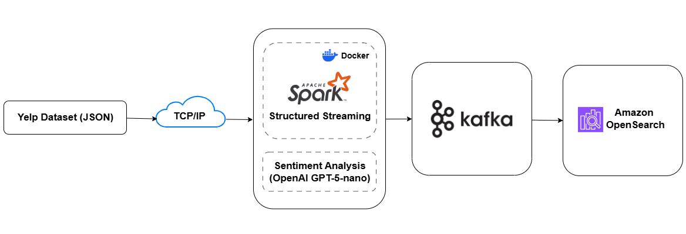
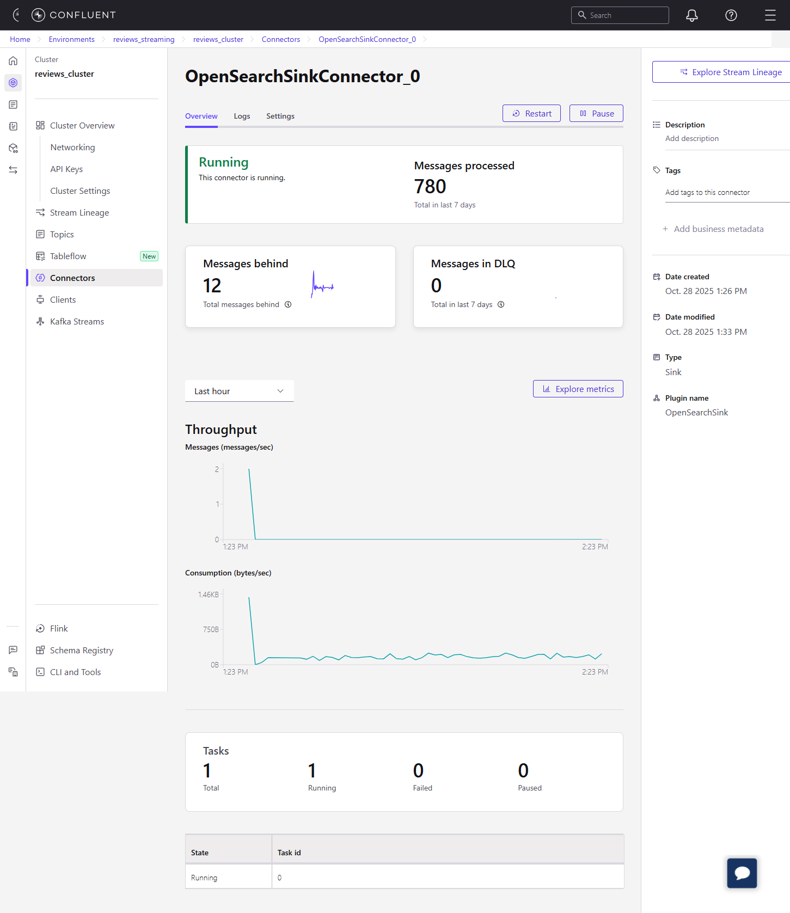
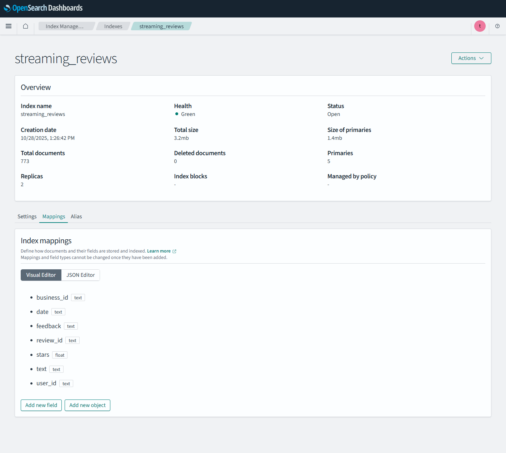

# Real-Time Data Streaming and Sentiment Analysis Pipeline  
**(Apache Spark | Confluent Kafka | AWS OpenSearch | OpenAI | Docker)**

---

## 1. Project Overview

This project implements a **real-time data streaming pipeline** that performs **sentiment analysis** on millions of text records using **Apache Spark Structured Streaming**, **Confluent Kafka**, and **AWS OpenSearch**.

It demonstrates how large-scale unstructured data — in this case, Yelp reviews — can be ingested, processed, analyzed, and indexed for visualization and search, all in **near real time**.

---

## 2. Key Objectives

- Stream raw JSON data from a socket source into Spark in real time.  
- Perform **sentiment classification** using the **OpenAI API** (implemented with `gpt-5-nano`).  
- Forward enriched results to a **Kafka topic** for downstream consumption.  
- Deliver data to **AWS OpenSearch** for visualization and text analytics.  
- Showcase a **production-style data flow** that’s modular, scalable, and cloud-ready.

---

## 3. Architecture Overview



### End-to-End Flow

1. **Data Ingestion (Socket Source)**  
   A local TCP server streams Yelp review records in small chunks to simulate live data.

2. **Stream Processing (Apache Spark)**  
   Spark Structured Streaming consumes data, performs schema parsing, and enriches each record with sentiment labels (**POSITIVE / NEGATIVE / NEUTRAL**) via the **OpenAI API**.

3. **Message Delivery (Confluent Kafka)**  
   Processed data is serialized and written to a Kafka topic (`streaming_reviews`).

4. **Indexing & Visualization (AWS OpenSearch)**  
   Kafka sink connectors stream the enriched data to OpenSearch, where it can be queried and visualized.

---

## 4. Pipeline Flow

| Stage | Component | Description |
|--------|------------|-------------|
| **1. Ingestion** | `streaming-socket.py` | Streams raw Yelp review data line-by-line over a TCP socket. |
| **2. Processing** | `spark-streaming.py` | Spark consumes from socket, performs sentiment analysis, and writes to Kafka. |
| **3. Delivery** | Kafka Sink Connector | Kafka connector streams records to AWS OpenSearch index. |
| **4. Search & Analytics** | OpenSearch Dashboards | Displays aggregated sentiment analytics and real-time trends. |

---

## 5. Spark Jobs Explained

### `streaming-socket.py`

Simulates a continuous stream of JSON data (Yelp reviews) by sending records line-by-line over a socket.  
Supports reconnection and resume functionality to handle disconnections gracefully.

```bash
docker exec -it spark-master spark-submit jobs/streaming-socket.py
```

### `spark-streaming.py`

Consumes live data from the socket stream using **Spark Structured Streaming**.  
Each review text is sent to the **OpenAI API** for sentiment classification (`gpt-5-nano` model used in this implementation).  
The results are then written to **Kafka** in JSON format.

```bash
docker exec -it spark-master spark-submit \
  --master spark://spark-master:7077 \
  --packages org.apache.spark:spark-sql-kafka-0-10_2.12:3.5.7 \
  jobs/spark-streaming.py
```

---

## 6. Repository Structure

```
tcp_streaming/
│
├── assets/
│   ├── architecture.png                # End-to-end architecture diagram
│   ├── opensearch_sink_connector.png   # Kafka–OpenSearch integration
│   └── opensearch_dashboards.png       # Visualization of indexed data
│
├── jobs/
│   ├── spark-streaming.py              # Spark Structured Streaming job
│   ├── streaming-socket.py             # Socket data producer
│   └── config/
│       └── config.example.py           # Example config file for credentials
│
├── schemas/
│   └── reviews.schema                  # Schema used in Confluent Kafka
│
├── datasets/
│   └── yelp_academic_dataset_review.json   # Yelp review dataset
│
├── Dockerfile.spark                    # Dockerfile for Spark master/worker setup
├── docker-compose.yml                  # Docker Compose setup for services
├── requirements.txt                    # Python dependencies
├── .gitignore                          # Excludes sensitive configs and large datasets
└── README.md                           # Project documentation


```


## 7. Screenshots

### Kafka–OpenSearch Integration


### AWS OpenSearch Index Overview


---

## 8. Setup and Execution

### Prerequisites

- **Docker & Docker Compose** installed  
- **Confluent Kafka** cluster credentials  
- **AWS OpenSearch** domain credentials  
- **OpenAI API key**  
- **Dataset:** `./assets/yelp_academic_dataset_review.json` — *not included in the repository*


### Install Dependencies
```bash
pip install -r requirements.txt
```


### Configure Secrets

Create your `config/config.py` file using the provided example:
```bash
cp config/config.example.py config/config.py
```

Update the file with:
- **OpenAI API key**
- **Confluent Kafka credentials**
- **AWS OpenSearch configuration** (via Kafka sink connector)


### Build Spark Container
```bash
docker build -t spark-image -f Dockerfile.spark .
```

### Start the Socket Stream
```bash
docker exec -it spark-master spark-submit jobs/streaming-socket.py
```

### Run Spark Streaming Job
```bash
docker exec -it spark-master spark-submit \
  --master spark://spark-master:7077 \
  --packages org.apache.spark:spark-sql-kafka-0-10_2.12:3.5.7 \
  jobs/spark-streaming.py
```

---

### View Results in OpenSearch Dashboards

Access your **OpenSearch** domain and explore indexed records, sentiment distributions, and real-time analytics.

## 9. Design Rationale

This architecture emphasizes **scalability**, **fault tolerance**, and **realism** — mirroring production-grade data engineering setups.

| Component | Role | Reason for Choice |
|------------|------|------------------|
| **Spark Structured Streaming** | Real-time data transformation | Handles high-throughput data and structured streaming |
| **OpenAI API** | Sentiment classification | Demonstrates AI integration in streaming pipelines |
| **Confluent Kafka** | Message broker | Provides durability and decouples processing layers |
| **AWS OpenSearch** | Indexing and visualization | Enables powerful full-text search and dashboarding |
| **Docker** | Environment consistency | Simplifies deployment and reproducibility |

---

## 10. Future Enhancements

- Integrate a **schema registry** for Kafka message validation.  
- Add **data quality monitoring** and pipeline health metrics.  
- Introduce **CI/CD workflow** for Spark job deployments.  
- Expand **OpenSearch visualizations** (e.g., geo sentiment heatmaps).  
- Containerize **Kafka + OpenSearch** locally for full-stack reproducibility.

---

## 11. Licensing and Credits

### Dataset

This project uses the **[Yelp Open Dataset](https://www.yelp.com/dataset)**.

---

## 12. Author

**Author:** Abimola Onibi  
**LinkedIn:** [linkedin.com/in/abimola-onibi](https://www.linkedin.com/in/abimola-onibi/)  
**GitHub:** [github.com/Abimola](https://github.com/Abimola)
